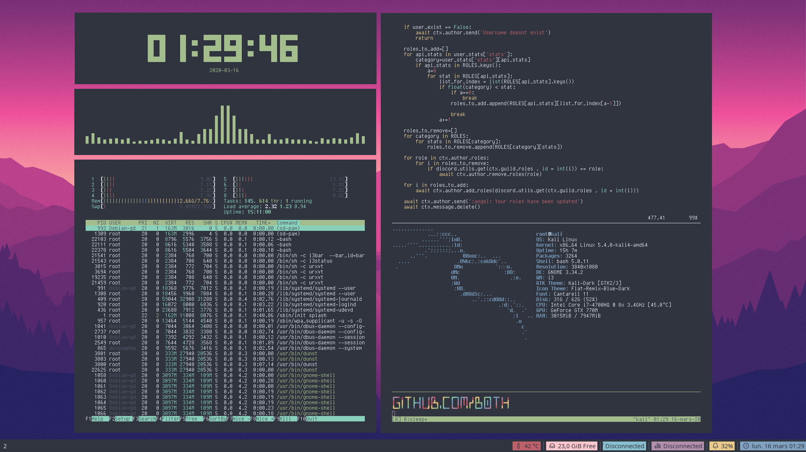

# 🧙‍ dotfiles

Based on https://github.com/addy-dclxvi/i3-starterpack

Directory : `$HOME`

`config` and `urxvt` are hidden/dot files

## Preview



## i3

In `#autostart` in `.config/i3/config` you can set this line as comment
```
exec --no-startup-id ~/monitors/./monitors_config.sh
``` 

## Install
run `install.sh`
